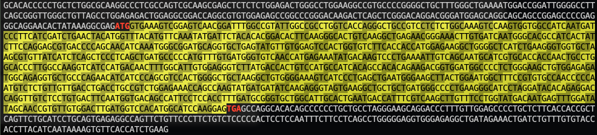

# GAP

<b>G</b>FF <b>A</b>nnotation <b>P</b>aser (GAP) is a tool for parsing Gencode/Ensembl GTF and NCBI GFF3 genome annotation files.

## Installation

### Prerequisites

Python 2.7

pysam: https://pypi.org/project/pysam/


### Installing

Add these lines to your `~/.bash_profile`, `[GAP]` is the <b>absolute</b> path of GAP.

```bash
export PYTHONPATH=[GAP]:$PYTHONPATH
export PATH=[GAP]:$PATH
```

## Main functions

* Fetch transcritome file from genome with GFF/GTF annotation;
* Conversion between three coordinate systems: Gene/Transcript/Genome;
* Get transcription information (chrID, gene type, length, CDS region...) given a transcription ID or gene name;
* Show mRNA structure
* ...

## Download data

> Gencode GTF/Genome: https://www.gencodegenes.org <br>
> Enesembl GTF/Genome: https://ensembl.org/info/data/ftp/index.html <br>
> NCBI GFF3/Genome: ftp://ftp.ncbi.nlm.nih.gov/genomes

## Quick start

#### 1. Convert a GTF file to *.genomeCoor.bed file
```shell
parseGTF.py -g chicken.gtf -o chicken -s ensembl --genome chicken_ensembl.fa
```
The genome file `--genome chicken_ensembl.fa` is optional.

It will produce three files: 

* `chicken.genomeCoor.bed`    -- A simple version of the genome-based annotation file
* `chicken.transCoor.bed`		-- A simple version of the transcript-based annotation file
* `chicken_transcriptome.fa`  -- Transcriptome file

#### 2. Read the annotation

```python
import GAP
chicken_parser = GAP.init("chicken.genomeCoor.bed", "chicken_transcriptome.fa")
```

Another way is to read the GTF file directly.

```python
chicken_parser = GAP.initGTF("chicken.gtf", genomeFile="chicken_ensembl.fa", source='Ensembl')
```

#### 3. Get all mRNAs

```python
mRNAs = chicken_parser.getmRNATransList(); print len(mRNAs)
# 30252
print mRNAs[:5]
# ['ENSGALT00000005443', 'ENSGALT00000005447', 'ENSGALT00000013873', 'ENSGALT00000001353', 'ENSGALT00000001352']
```
It shows that chicken has 30252 mRNA transcripts.

#### 4. Get GAPDH gene id and transcripts

```python
GAPDH_gID = chicken_parser.getGeneByGeneName("GAPDH"); print GAPDH_gID
# ENSGALG00000014442

GAPDH_transcripts = chicken_parser.getTransByGeneID(GAPDH_gID); print GAPDH_transcripts
# ['ENSGALT00000046744', 'ENSGALT00000086833', 'ENSGALT00000023323', 'ENSGALT00000086032', 'ENSGALT00000074237', 'ENSGALT00000090208', 'ENSGALT00000051222', 'ENSGALT00000054080', 'ENSGALT00000089752', 'ENSGALT00000085687']

## Print all transcript gene type and length
for tid in GAPDH_transcripts:
	trans_feature = chicken_parser.getTransFeature(tid)
	print tid, trans_feature['gene_type'], trans_feature['trans_len']

# ENSGALT00000046744 protein_coding 1076
# ENSGALT00000086833 protein_coding 1122
# ENSGALT00000023323 protein_coding 1288
# ENSGALT00000086032 protein_coding 1302
# ENSGALT00000074237 protein_coding 1091
# ENSGALT00000090208 protein_coding 670
# ENSGALT00000051222 protein_coding 1179
# ENSGALT00000054080 protein_coding 1498
# ENSGALT00000089752 protein_coding 434
# ENSGALT00000085687 protein_coding 991
```

#### 5. Get UTR and CDS region of longest transcript of GAPDH

```python
## Method 1
ft = chicken_parser.getTransFeature("ENSGALT00000054080")
cds_start, cds_end = ft['cds_start'], ft['cds_end']
GAPDH = chicken_parser.getTransSeq("ENSGALT00000054080")

UTR_5 = GAPDH[:cds_start-1]
CDS = GAPDH[cds_start-1:cds_end]
UTR_3 = GAPDH[cds_end:]

## Method 2
print chicken_parser.showRNAStructure("ENSGALT00000054080")
```


#### 6. Get genome coordination of GAPDH start codon

```python
chrID, chrPos, strand = chicken_parser.transCoor2genomeCoor("ENSGALT00000054080", cds_start)
print chrID, chrPos, strand
# ['1', 76953317, '+']
```
It shows that GAPDH start codon is located at 76953317 of positive strand of chromosome 1

#### 7. Find and label all GGAC motifs in GAPDH

```python
## Get Sequence
seq = chicken_parser.getTransSeq("ENSGALT00000054080")

## Collect motif sites
locs = []
start = 0
while 1:
    start = seq.find("GGAC", start+1)
    if start == -1: break
    locs.append(start)

## Label
for loc in locs:
    print str(loc)+"\t"+chicken_parser.labelRNAPosition("ENSGALT00000054080", [loc,loc])
```


## Notice

Complete documentation is in doc/Introduction.html


## Authors

* **Li Pan** - *Programmer* - [Zhanglab](http://zhanglab.life.tsinghua.edu.cn)


