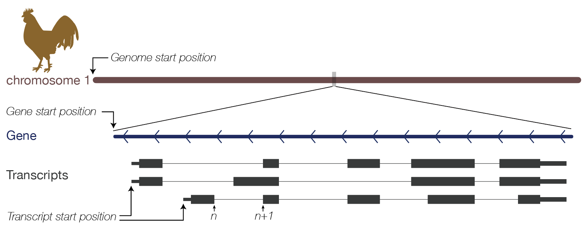

# GAP

<b>G</b>FF <b>A</b>nnotation <b>P</b>aser (GAP) is a tool for parsing Gencode/Ensembl GTF and NCBI GFF3 genome annotation files.

## Installation

### Prerequisites

Python 2.7

pysam: https://pypi.org/project/pysam/


### Installing

Add these lines to your `~/.bash_profile`, `[GAP]` is the <b>absolute</b> path of GAP.

```bash
export PYTHONPATH=[GAP]:$PYTHONPATH
export PATH=[GAP]:$PATH
```

## Main functions

* Fetch transcritome file from genome with GFF/GTF annotation;
* Conversion between three coordinate systems: Gene/Transcript/Genome;
* Get transcription information (chrID, gene type, length, CDS region...) given a transcription ID or gene names;
* Show mRNA structure
* ...

## Data source

> Gencode GTF/Genome: https://www.gencodegenes.org <br>
> Enesembl GTF/Genome: https://asia.ensembl.org/info/data/ftp/index.html <br>
> NCBI GFF3/Genome: ftp://ftp.ncbi.nlm.nih.gov/genomes

## Quick start

#### 1. Convert an GTF file to *.genomeCoor.bed file
```shell
parseGTF.py -g chicken.gtf -o chicken -s ensembl --genome chicken_ensembl.fa
```
The genome file `chicken_ensembl.fa` is optional.

It will produce three files: 

* `chicken.genomeCoor.bed`    -- A simple version of the genome-based annotation file
* `chicken.transCoor.bed`		-- A simple version of the transcript-based annotation file
* `chicken_transcriptome.fa`  -- Transcriptome file

#### 2. Read the annotation

```python
import GAP
chicken_parser = GAP.init("chicken.genomeCoor.bed", "chicken_transcriptome.fa")
```

Another way is to read the GTF file directly.

```python
chicken_parser = GAP.initGTF("chicken.gtf", genomeFile="chicken_ensembl.fa", source='Ensembl')
```

#### 3. Get all mRNAs

```python
mRNAs = chicken_parser.getmRNATransList(); print len(mRNAs)
# 30252
print mRNAs[:5]
# ['ENSGALT00000005443', 'ENSGALT00000005447', 'ENSGALT00000013873', 'ENSGALT00000001353', 'ENSGALT00000001352']
```
It shows that chicken has 30252 mRNA transcripts.

#### 4. Get GAPDH gene id and transcripts

```python
GAPDH_gID = chicken_parser.getGeneByGeneName("GAPDH"); print GAPDH_gID
# ENSGALG00000014442

GAPDH_transcripts = chicken_parser.getTransByGeneID(GAPDH_gID); print GAPDH_transcripts
# ['ENSGALT00000046744', 'ENSGALT00000086833', 'ENSGALT00000023323', 'ENSGALT00000086032', 'ENSGALT00000074237', 'ENSGALT00000090208', 'ENSGALT00000051222', 'ENSGALT00000054080', 'ENSGALT00000089752', 'ENSGALT00000085687']

## Print all transcript gene type and length
for tid in GAPDH_transcripts:
	trans_feature = chicken_parser.getTransFeature(tid)
	print tid, trans_feature['gene_type'], trans_feature['trans_len']

# ENSGALT00000046744 protein_coding 1076
# ENSGALT00000086833 protein_coding 1122
# ENSGALT00000023323 protein_coding 1288
# ENSGALT00000086032 protein_coding 1302
# ENSGALT00000074237 protein_coding 1091
# ENSGALT00000090208 protein_coding 670
# ENSGALT00000051222 protein_coding 1179
# ENSGALT00000054080 protein_coding 1498
# ENSGALT00000089752 protein_coding 434
# ENSGALT00000085687 protein_coding 991
```

#### 5. Get UTR and CDS region of longest transcript of GAPDH

```python
## Method 1
ft = chicken_parser.getTransFeature("ENSGALT00000054080")
cds_start, cds_end = ft['cds_start'], ft['cds_end']
GAPDH = chicken_parser.getTransSeq("ENSGALT00000054080")

UTR_5 = GAPDH[:cds_start-1]
CDS = GAPDH[cds_start-1:cds_end]
UTR_3 = GAPDH[cds_end:]

## Method 2
print chicken_parser.show_mRNA_structure("ENSGALT00000054080")
```


#### 6. Get genome coordination of GAPDH start codon

```python
chrID, chrPos, strand = chicken_parser.transCoor2genomeCoor("ENSGALT00000054080", cds_start)
print chrID, chrPos, strand
# ['1', 76953317, '+']
```
It shows that GAPDH start codon is located at 76953317 of positive strand of chromosome 1

#### 7. Find and label all GGAC motifs in GAPDH

```python
## Get Sequence
seq = chicken_parser.getTransSeq("ENSGALT00000054080")

## Collect motif sites
locs = []
start = 0
while 1:
    start = seq.find("GGAC", start+1)
    if start == -1: break
    locs.append(start)

## Label
for loc in locs:
    print str(loc)+"\t"+chicken_parser.label_RNA_position("ENSGALT00000054080", [loc,loc])
```


<style>
.hov:hover {
	background-color: Tomato;
	color: white;
	cursor:pointer;
}

.hov {
	display:inline-block;
	border:1px solid black;
	padding:6px;
	border-radius:8px;
	font-family:Consolas,Monaco,Lucida Console,Liberation Mono,DejaVu Sans Mono, sans-serif;
	float:left;
	margin-left: 10px;
	margin-right: 10px;
	margin-bottom: 10px;
	width: 250px;
	text-align: center;
	text-decoration: none;
	color: darkblue;
}

.clearfix:after {
	content: "";
	clear: both;
	display: table;
}
</style>

## Subjects

### Init a GAP object

> There are two ways to init a GAP object: <br />
> 1. Convert the GTF or GFF3 file to a *.genomeCoor.bed file and read it;<br />
> 2. Read the GTF or GFF3 directly.

#### Method 1 -- Parse GTF/GFF3 file

```bash
parseGTF.py -g chicken.gtf -o chicken -s ensembl --genome chicken_ensembl.fa
```
The `--genome` is optional.

```python
import GAP
chicken_parser = GAP.init("chicken.genomeCoor.bed", "chicken_transcriptome.fa")
```

#### Method 2 -- Read GTF/GFF3 directly

```python
import GAP
chicken_parser = GAP.initGTF("chicken.gtf", genomeFile="chicken_ensembl.fa", source='Ensembl')
```

<div class="clearfix">
<a class="hov" style="" src="#">GAP.init</a>
<a class="hov" src="#">GAP.initGTF</a>
<a class="hov" src="#">addSeq</a>
</div>

### Get transcript or gene information
<div class="clearfix">
<a class="hov" style="" src="#">getTransFeature</a>
<a class="hov" src="#">getGeneParser</a>
<a class="hov" style="" src="#">getGeneIntron</a>
<a class="hov" src="#">getGeneExon</a>
<a class="hov" src="#">getGeneCombinedIntronExon</a>
</div>

### Coordinate transformation




<div class="clearfix">
<a class="hov" style="" src="#">geneCoor2genomeCoor</a>
<a class="hov" src="#">genomeCoor2geneCoor</a>
<a class="hov" style="" src="#">genomeCoor2transCoor</a>
<a class="hov" src="#">transCoor2genomeCoor</a>
<a class="hov" style="" src="#">transCoor2geneCoor</a>
<a class="hov" src="#">geneCoor2transCoor</a>
</div>

### Get transcript list or gene list

<div class="clearfix">
<a class="hov" style="" src="#">getTransList</a>
<a class="hov" src="#">getGeneList</a>
<a class="hov" style="" src="#">getmRNATransList</a>
<a class="hov" src="#">getmRNAGeneList</a>
<a class="hov" style="" src="#">getLenSortedTransDictForGenes</a>
<a class="hov" src="#">getTransByGeneID</a>
<a class="hov" style="" src="#">getGeneByGeneName</a>
<a class="hov" src="#">getTransByGeneName</a>
<a class="hov" src="#">getTransByGeneType</a>
</div>

### Get transcript sequence and mRNA structure

<div class="clearfix">
<a class="hov" style="" src="#">getTransSeq</a>
<a class="hov" src="#">show_mRNA_structure</a>
<a class="hov" src="#">label_RNA_position</a>
<a class="hov" src="#">get_RNA_position</a>
</div>


## Functions

#### <span style="color:DarkGreen;font-family:menlo, sans-serif">GAP.init(genomeCoorBedFile, seqFn="", showAttr=True, rem\_tVersion=False, rem\_gVersion=False)</span>

##### <span style="color:darkred">Features</span>
<pre>
Init a GAP object from *.genomeCoor.bed file
</pre>

##### <span style="color:darkred">Parameters</span>
<pre>
genomeCoorBedFile   -- A *.genomeCoor.bed file produced by parseGTF.py
seqFn               -- Transcriptome fasta file produced by parseGTF.py
showAttr            -- Show an example
rem_tVersion        -- Remove version information. ENST000000022311.2 => ENST000000022311
rem_gVersion        -- Remove version information. ENSG000000022311.2 => ENSG000000022311
</pre>

##### <span style="color:darkred">Return</span>
<pre>
GAP object
</pre>


#### <span style="color:DarkGreen;font-family:menlo, sans-serif">initGTF(AnnotationGTF, source, genomeFile="", showAttr=True, rem\_tVersion=False, rem\_gVersion=False, verbose=False)</span>

##### <span style="color:darkred">Features</span>
<pre>
Init a GAP object from GTF/GFF3 file
</pre>

##### <span style="color:darkred">Parameters</span>
<pre>
AnnotationGTF       -- Ensembl/Gencode GTF file or NCBI GFF3 file
genomeFile          -- Genome file
source              -- Gencode/Ensembl/NCBI
showAttr            -- Show an example
rem_tVersion        -- Remove version information. ENST000000022311.2 => ENST000000022311
rem_gVersion        -- Remove version information. ENSG000000022311.2 => ENSG000000022311
verbose             -- Show process information
</pre>

##### <span style="color:darkred">Return</span>
<pre>
GAP object
</pre>


#### <span style="color:DarkGreen;font-family:menlo, sans-serif">addSeq(seqFileName, remove\_tid\_version=False)</span>

##### <span style="color:darkred">Features</span>
<pre>
If the sequence is not provided when init a GAP object, add the sequence to it.
</pre>

##### <span style="color:darkred">Parameters</span>
<pre>
seqFileName         -- Transcriptome fasta file produced by parseGTF.py
remove_tid_version  -- Remove version information. ENST000000022311.2 => ENST000000022311
</pre>

##### <span style="color:darkred">Return</span>
<pre>
No
</pre>

#### <span style="color:DarkGreen;font-family:menlo, sans-serif">getTransFeature(transID, showAttr=False, verbose=True)</span>

##### <span style="color:darkred">Features</span>
<pre>
Get transcript features given the transcript id
</pre>

##### <span style="color:darkred">Parameters</span>
<pre>
transID             -- Transcript ID
showAttr            -- Show an example
verbose             -- Print the warning information when transcript not found
</pre>

##### <span style="color:darkred">Return</span>
<pre>
Return a dictionary:
    chr             -- Genome chromosome
    strand          -- + or -
    start           -- Genome start
    end             -- Genome end
    
    gene_name       -- Gene symbol
    gene_id         -- Gene id
    gene_type       -- Gene type
    
    trans_len       -- Transcript length
    
    utr_5_start     -- Transcript-based start site of 5'UTR
    utr_5_end       -- Transcript-based end site of 5'UTR
    cds_start       -- Transcript-based start site of CDS
    cds_end         -- Transcript-based end site of CDS
    utr_3_start     -- Transcript-based start site of 3'UTR
    utr_3_end       -- Transcript-based end site of 3'UTR
    
    exon_str        -- Genome-based exon string
</pre>

#### <span style="color:DarkGreen;font-family:menlo, sans-serif">getGeneParser(showAttr=True)</span>

##### <span style="color:darkred">Features</span>
<pre>
Get gene parser with gene informations
</pre>

##### <span style="color:darkred">Parameters</span>
<pre>
showAttr            -- Show an example
</pre>

##### <span style="color:darkred">Return</span>
<pre>
Return a list of dictionaries:
    { geneID => { ... }, ... } includes
        chr         -- Genome chromosome
        strand      -- + or -
        start       -- Genome start
        end         -- Genome end
        
        gene_name   -- Gene symbol
        gene_type   -- All transcript types
        
        length      -- Gene length (end-start+1)
        
        transcript  -- All transcripts belong to this gene
</pre>

#### <span style="color:DarkGreen;font-family:menlo, sans-serif">getGeneIntron(geneID)</span>

##### <span style="color:darkred">Features</span>
<pre>
Get genome-based intron corrdinates of given gene
</pre>

##### <span style="color:darkred">Parameters</span>
<pre>
geneID              -- Gene id
</pre>

##### <span style="color:darkred">Return</span>
<pre>
Get introns of all transcripts of this gene:
            { transID => [[intron1_start, intron1_end], [intron2_start, intron2_end], [intron3_start, intron3_end]],... }
</pre>

#### <span style="color:DarkGreen;font-family:menlo, sans-serif">getGeneExon(geneID)</span>

##### <span style="color:darkred">Features</span>
<pre>
Get genome-based exon corrdinates of given gene
</pre>

##### <span style="color:darkred">Parameters</span>
<pre>
geneID              -- Gene id
</pre>

##### <span style="color:darkred">Return</span>
<pre>
Get exons of all transcripts of this gene:
            { transID => [[exon1_start, exon1_end], [exon2_start, exon2_end], [exon3_start, exon3_end]...],... }
</pre>

#### <span style="color:DarkGreen;font-family:menlo, sans-serif">geneCoor2genomeCoor(geneID, pos)</span>

##### <span style="color:darkred">Features</span>
<pre>
Convert gene-based coordinates to genome-based coordinates
</pre>

##### <span style="color:darkred">Parameters</span>
<pre>
geneID              -- Gene id
pos                 -- Gene-based position
</pre>

##### <span style="color:darkred">Return</span>
<pre>
Return: [chrID, chrPos, Strand]
</pre>

#### <span style="color:DarkGreen;font-family:menlo, sans-serif">genomeCoor2geneCoor(chrID, start, end, strand)</span>

##### <span style="color:darkred">Features</span>
<pre>
Convert genome-based coordinates to gene-based coordinates
</pre>

##### <span style="color:darkred">Parameters</span>
<pre>
chrID               -- Chromosome id
start               -- Chromosome-based start position
end                 -- Chromosome-based end position
strand              -- Chromosome strand
</pre>

##### <span style="color:darkred">Return</span>
<pre>
Return [ [chrID, chrStart, chrEnd, geneID, geneStart, geneEnd], ... ]
</pre>

#### <span style="color:DarkGreen;font-family:menlo, sans-serif">genomeCoor2transCoor(chrID, start, end, strand)</span>

##### <span style="color:darkred">Features</span>
<pre>
Convert genome-based coordinates to transcript-based coordinates
</pre>

##### <span style="color:darkred">Parameters</span>
<pre>
chrID               -- Chromosome id
start               -- Chromosome-based start position
end                 -- Chromosome-based end position
strand              -- Chromosome strand
</pre>

##### <span style="color:darkred">Return</span>
<pre>
Return [ [chrID, chrStart, chrEnd, transID, transStart, transEnd], ... ]
</pre>

#### <span style="color:DarkGreen;font-family:menlo, sans-serif">transCoor2genomeCoor(transID, pos)</span>

##### <span style="color:darkred">Features</span>
<pre>
Convert transcript-based coordinates to genome-based coordinates
</pre>

##### <span style="color:darkred">Parameters</span>
<pre>
transID             -- Transcript id
pos                 -- Transcript-based position
</pre>

##### <span style="color:darkred">Return</span>
<pre>
Return [chrID, chrPos, Strand]
</pre>

#### <span style="color:DarkGreen;font-family:menlo, sans-serif">geneCoor2transCoor(geneID, start, end)</span>

##### <span style="color:darkred">Features</span>
<pre>
Convert gene-based coordinates to transcript-based coordinates
</pre>

##### <span style="color:darkred">Parameters</span>
<pre>
geneID              -- Gene id
start               -- Gene-based start position
end                 -- Gene-based end position
</pre>

##### <span style="color:darkred">Return</span>
<pre>
Return  [chrID, chrStart, chrEnd, transID, transStart, transEnd], ... ]
</pre>

#### <span style="color:DarkGreen;font-family:menlo, sans-serif">transCoor2geneCoor(transID, start, end)</span>

##### <span style="color:darkred">Features</span>
<pre>
Convert transcript-based coordinates to gene-based coordinates
</pre>

##### <span style="color:darkred">Parameters</span>
<pre>
transID             -- Transcript id
start               -- Transcript-based start position
end                 -- Transcript-based end position
</pre>

##### <span style="color:darkred">Return</span>
<pre>
return [ [chrID, chrStart, chrEnd, geneID, geneStart, geneEnd], ... ]
</pre>

#### <span style="color:DarkGreen;font-family:menlo, sans-serif">getTransList()</span>

##### <span style="color:darkred">Features</span>
<pre>
Return list of all transcript id
</pre>

##### <span style="color:darkred">Parameters</span>
<pre>
No
</pre>

##### <span style="color:darkred">Return</span>
<pre>
return [ transID1, transID2, ... ]
</pre>

#### <span style="color:DarkGreen;font-family:menlo, sans-serif">getGeneList()</span>

##### <span style="color:darkred">Features</span>
<pre>
Return list of all gene id
</pre>

##### <span style="color:darkred">Parameters</span>
<pre>
No
</pre>

##### <span style="color:darkred">Return</span>
<pre>
return [ geneID1, geneID2, ... ]
</pre>

#### <span style="color:DarkGreen;font-family:menlo, sans-serif">getmRNATransList()</span>

##### <span style="color:darkred">Features</span>
<pre>
Return list of all mRNA id
</pre>

##### <span style="color:darkred">Parameters</span>
<pre>
No
</pre>

##### <span style="color:darkred">Return</span>
<pre>
return [ mRNAID1, mRNAID2, ... ]
</pre>

#### <span style="color:DarkGreen;font-family:menlo, sans-serif">getmRNAGeneList()</span>

##### <span style="color:darkred">Features</span>
<pre>
Return list of all mRNA gene id
</pre>

##### <span style="color:darkred">Parameters</span>
<pre>
No
</pre>

##### <span style="color:darkred">Return</span>
<pre>
return [ mRNAGeneID1, mRNAGeneID2, ... ]
</pre>

#### <span style="color:DarkGreen;font-family:menlo, sans-serif">getLenSortedTransDictForGenes(only=[])</span>

##### <span style="color:darkred">Features</span>
<pre>
Return a dictionary of geneID to sorted transID list
</pre>

##### <span style="color:darkred">Parameters</span>
<pre>
only                --  Contraint transcript types, such as mRNA, snRNA ...
</pre>

##### <span style="color:darkred">Return</span>
<pre>
return { geneID => [ transID1, transID2, ... ], ...}
transcripts are sorted by length
</pre>

#### <span style="color:DarkGreen;font-family:menlo, sans-serif">getTransByGeneID(geneID)</span>

##### <span style="color:darkred">Features</span>
<pre>
Return transcripts belong to specific gene
</pre>

##### <span style="color:darkred">Parameters</span>
<pre>
geneID              -- Gene id
</pre>

##### <span style="color:darkred">Return</span>
<pre>
return [ transID1, transID2... ]
</pre>

#### <span style="color:DarkGreen;font-family:menlo, sans-serif">getGeneByGeneName(geneName)</span>

##### <span style="color:darkred">Features</span>
<pre>
Return gene id with specific gene name
</pre>

##### <span style="color:darkred">Parameters</span>
<pre>
geneName            -- Gene symbol
</pre>

##### <span style="color:darkred">Return</span>
<pre>
return geneID
</pre>

#### <span style="color:DarkGreen;font-family:menlo, sans-serif">getTransByGeneName(geneName)</span>

##### <span style="color:darkred">Features</span>
<pre>
Return transcripts belong to specific gene
</pre>

##### <span style="color:darkred">Parameters</span>
<pre>
geneName            -- Gene symbol
</pre>

##### <span style="color:darkred">Return</span>
<pre>
return [ transID1, transID2... ]
</pre>

#### <span style="color:DarkGreen;font-family:menlo, sans-serif">getTransByGeneType(geneType)</span>

##### <span style="color:darkred">Features</span>
<pre>
 Return a list of transcripts belong to specific gene type
</pre>

##### <span style="color:darkred">Parameters</span>
<pre>
geneType            -- Gene type
</pre>

##### <span style="color:darkred">Return</span>
<pre>
return [ transID1, transID2... ]
</pre>

#### <span style="color:DarkGreen;font-family:menlo, sans-serif">getTransSeq(transID)</span>

##### <span style="color:darkred">Features</span>
<pre>
 Return transcript sequence
</pre>

##### <span style="color:darkred">Parameters</span>
<pre>
transID             -- Transcript id
</pre>

##### <span style="color:darkred">Return</span>
<pre>
return sequence
</pre>

#### <span style="color:DarkGreen;font-family:menlo, sans-serif">getGeneCombinedIntronExon(geneID, verbose=True)</span>

##### <span style="color:darkred">Features</span>
<pre>
Parse gene intron/exon regions:
    1. Combine exons from all transcripts, they are defined as exon regions
    2. Remove the exon regions from gene regions, they are defined as intron regions
</pre>

##### <span style="color:darkred">Parameters</span>
<pre>
geneID          -- Gene id
verbose         -- Print error information when error occured
</pre>

##### <span style="color:darkred">Return</span>
<pre>
return: [intron_regions, exon_regions]
</pre>

#### <span style="color:DarkGreen;font-family:menlo, sans-serif">show\_mRNA\_structure(transID)</span>

##### <span style="color:darkred">Features</span>
<pre>
Return string of mRNA sequence with color labeled its UTR/CDS/Codons
</pre>

##### <span style="color:darkred">Parameters</span>
<pre>
transID         -- Transcript id
</pre>

##### <span style="color:darkred">Return</span>
<pre>
return: colored sequence
</pre>

#### <span style="color:DarkGreen;font-family:menlo, sans-serif">label\_RNA\_position(transID, region, bn=None, bw=None)</span>

##### <span style="color:darkred">Features</span>
<pre>
Return string of mRNA sequence with color labeled its UTR/CDS/Codons

        return RNA structure and label the region
        -------|||||||||||||||||--------------------------
         5'UTR        CDS                3'UTR
</pre>

##### <span style="color:darkred">Parameters</span>
<pre>
transID         -- Transcript id
region          -- [start, end]
bn              -- Bin number (default: 50)
bw              -- Bin width
bw and bn cannot be specified at the same time
</pre>

##### <span style="color:darkred">Return</span>
<pre>
return: -------|||||||||||||||||--------------------------
</pre>

#### <span style="color:DarkGreen;font-family:menlo, sans-serif">get\_RNA\_position(transID, region)</span>

##### <span style="color:darkred">Features</span>
<pre>
Get the position of region located in mRNA
</pre>

##### <span style="color:darkred">Parameters</span>
<pre>
transID         -- Transcript id
region          -- [start, end]
</pre>

##### <span style="color:darkred">Return</span>
<pre>
Return any one of:
    -> not_mRNA
    -> 5UTR
    -> span_5UTR_CDS
    -> CDS
    -> span_CDS_3UTR
    -> 3UTR
    -> span_5UTR_CDS_3UTR
    -> INVALID
</pre>

## Authors

* **Li Pan** - *Programmer* - [Zhanglab](http://zhanglab.life.tsinghua.edu.cn)


